# Campus Connect

A platform for students to connect, collaborate, and manage academic activities.

---

## Features

### 1. Discussion Forum

- A dynamic Q&A platform inspired by Stack Overflow and LeetCode discussions.
- **Users can:**
  - Post questions and provide answers.
  - Upvote/downvote questions and answers.
  - Reply to answers.
  - Search questions by tags.
  - Sort questions by category, most upvotes, or latest.
  - Use a pagination slider to reduce load on the database.
- **Discussion Forum:**  
  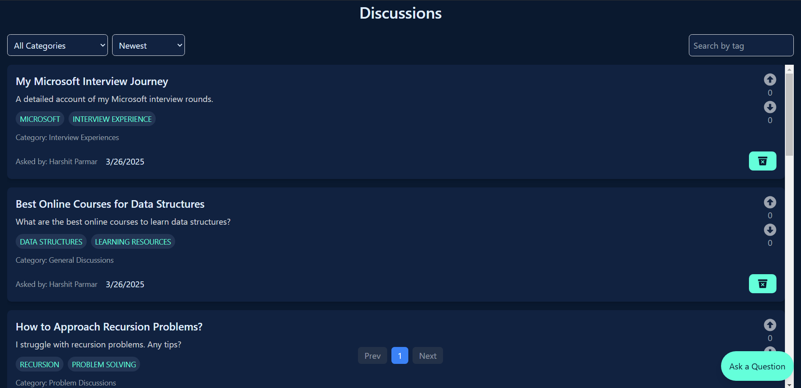

### 2. Chat System

- Real-time messaging for seamless communication.
- **Features include:**
  - One-on-one chats and group chats (public or private).
  - Group creation based on interest tags.
  - Search and join public groups by tags.
  - Media sharing enabled.
  - Group-specific features:
    - Poll creation.
    - Pinned messages (admin-only).
- **Chat System:**  
  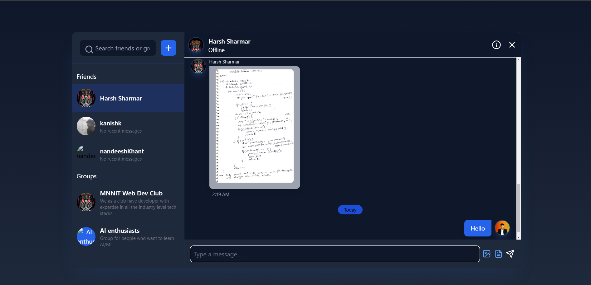

### 3. Virtual Study Room

- A dedicated space for students to collaborate and stay focused.
- **Features:**
  - Add and complete tasks.
  - Real-time integrated chat.
  - Synchronized timer that stays consistent for all participants.
  - Break feature to schedule short rests during study sessions.
  - Collaborative Whiteboard where everyone can draw and write together.
- **Virtual Study Room:**  
  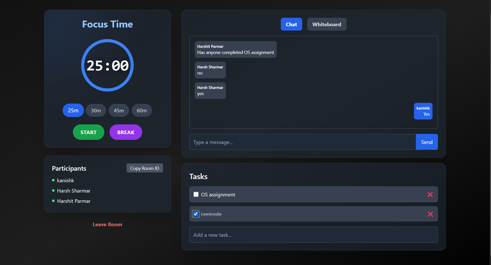  
  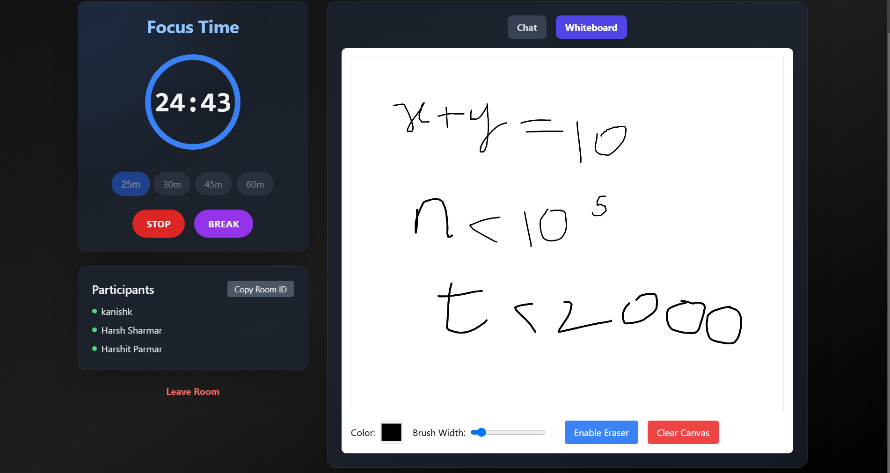

### 4. Marketplace

- A platform for students to buy, sell, or exchange study materials and academic resources.
- **Features include:**
  - Post listings for books, gadgets, or study aids.
  - Search and filter listings by category, price, or condition.
  - Chat directly with sellers.
  - Secure payment integration.
  - Wishlist page to save items for future consideration.
  - My Listings page to manage your posted items.
- **Marketplace:**  
  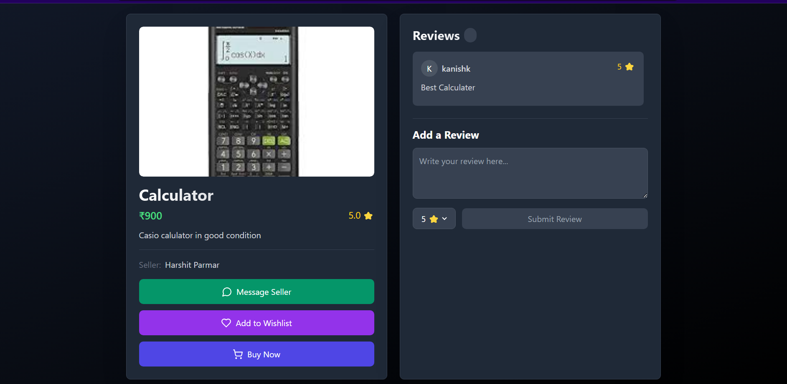  
  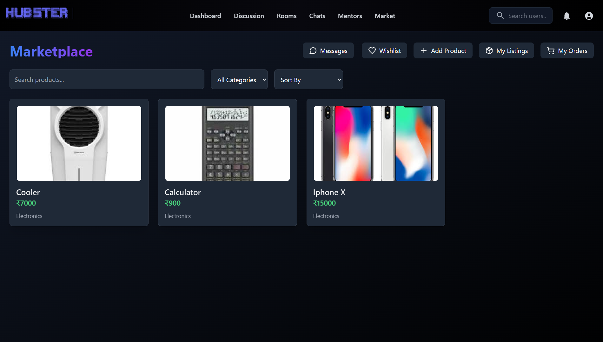

### 5. Student & Mentor Management

- Students can **view approved mentors**.
- A student must fill a mentorship form to become a mentor.
- Mentors are visible only if approved by an admin.
- Mentors can upload a profile photo to personalize their profiles.
- Real-time chat with mentors.
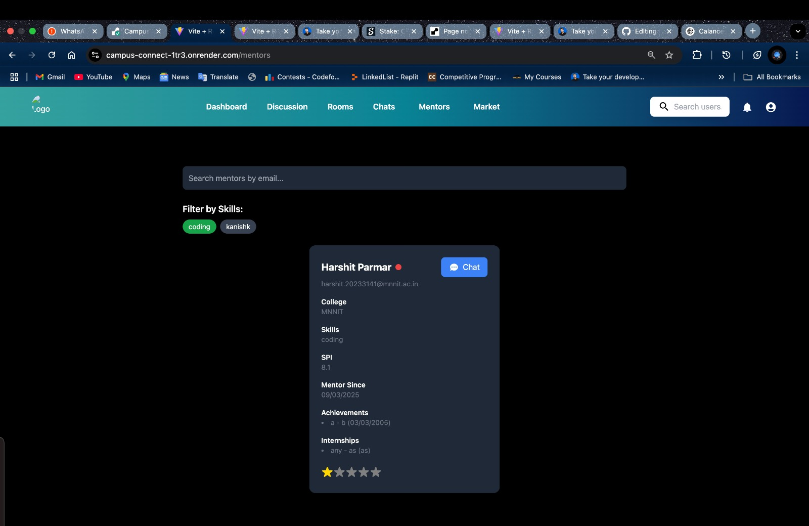
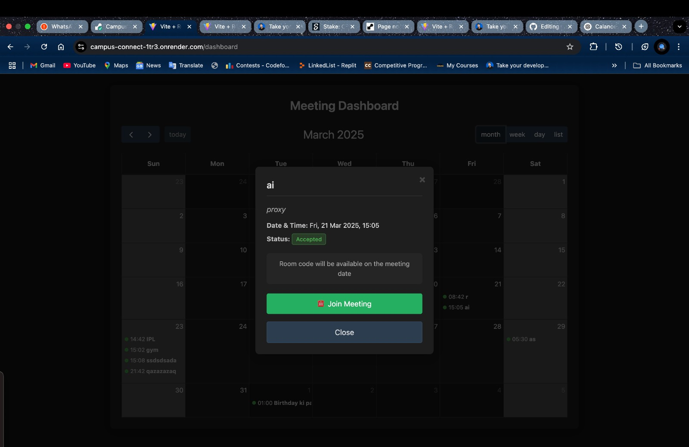

### 6. Admin Role & Approvals

- The first admin of a college is generated by the developers.
- Admins can promote students from other colleges to an admin role.
- Admins can approve or reject mentorship applications.
- Mentors are notified of approval or rejection decisions.
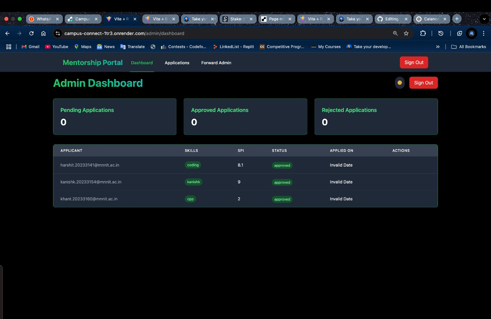
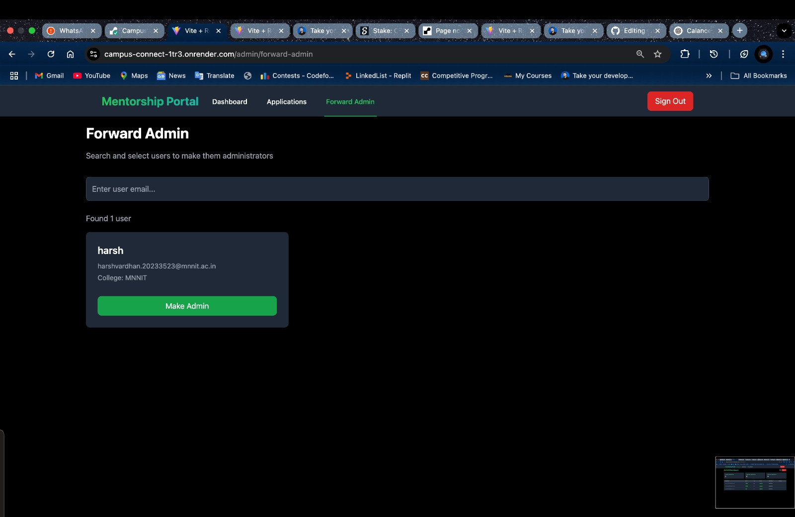

### 7. Video Calls (WebRTC-based)

- On the day of a meeting, a room code is shared with both the mentor and the student.
- Peer-to-peer video calling is enabled via WebRTC.
- Screen sharing is supported during calls.
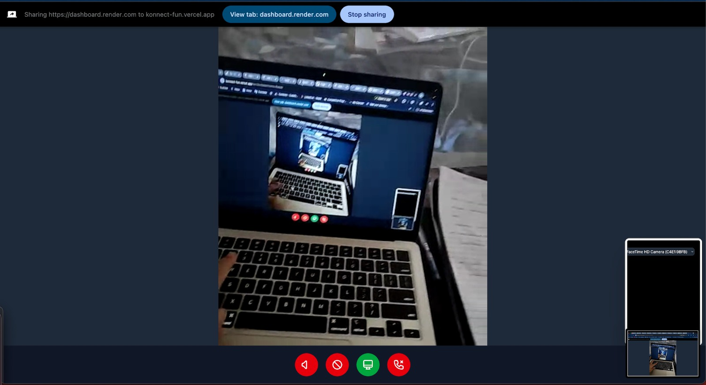

---

## Backend

### Steps

1. **Add a `.env` file** and provide the following environment variables:

   ```env
   PORT="3000"
   MONGODB_URI="<Your MongoDB Connection String>"
   EMAIL_USER="<Your Email Address>"
   EMAIL_PASS="<Your Email Password>"
   JWT_SECRET="<Your JWT Secret>"
   ```

2. **Install dependencies:**

   ```bash
   npm install
   ```

3. **Run the project locally:**

   ```bash
   npm run start
   ```

---

## Frontend

### Steps

1. **Install dependencies:**

   ```bash
   npm install
   ```

2. **Run the development server:**

   ```bash
   npm run dev
   ```

---
